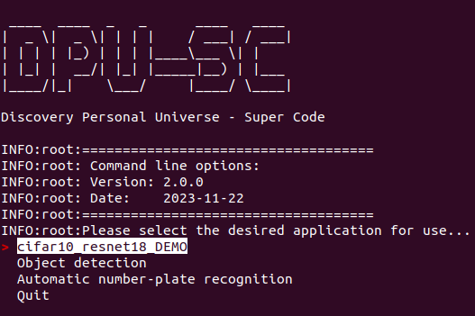
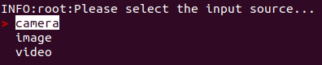
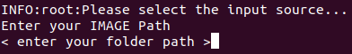
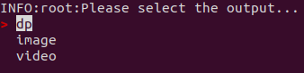
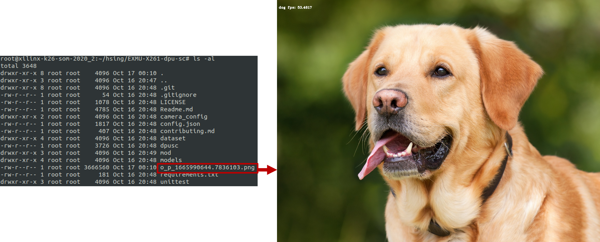
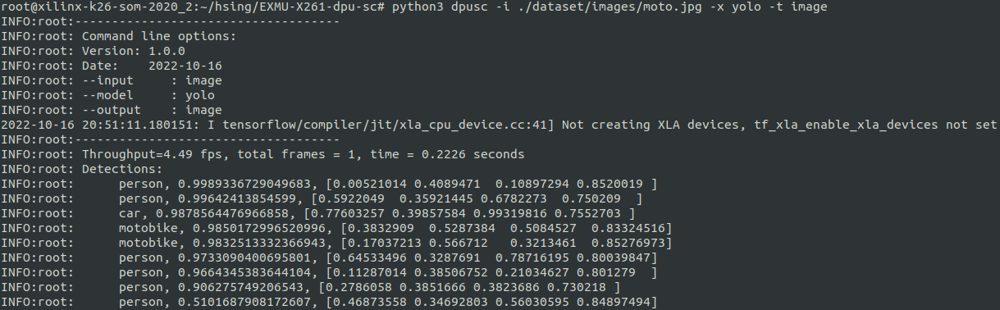
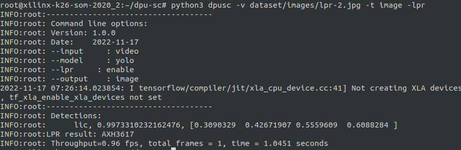
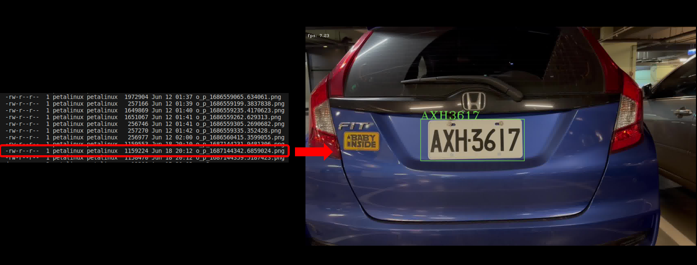

<!--
 Copyright (c) 2022 Innodisk Crop.
 
 This software is released under the MIT License.
 https://opensource.org/licenses/MIT
-->

# dpu-sc 
- [dpu-sc](#dpu-sc)
- [Description](#description)
- [Requirements](#requirements)
    - [Dependencies on platform](#dependencies-on-platform)
    - [Python's requirements](#pythons-requirements)
- [How to use dpusc](#how-to-use-dpusc)
  - [Example](#example)
  - [Example-Cifar10 Resnet18 DEMO](#example-cifar10-resnet18-demo)
  - [Example-Object detection](#example-object-detection)
  - [Example-Automatic number-plate recognition](#example-automatic-number-plate-recognition)
- [Config.json](#configjson)
- [Unit Test](#unit-test)
    - [Usage](#usage)
- [FAQ](#faq)
  - [Can't download and install tensorflow-2.4.1?](#cant-download-and-install-tensorflow-241)
  - [Contribution](#contribution)
  - [License](#license)


# Description
dpu-sc presented a rapid demo which run AI inference on DPU with MPSoC.

# Requirements
### Dependencies on platform
- [EXMU-X261](https://github.com/InnoIPA/EXMU-X261-usermanual)
- Xilinx [KV260](https://www.xilinx.com/products/som/kria/kv260-vision-starter-kit.html)
  - Opencv
  - XIR
  - VART
  - Vitis-AI 2.5


### Python's requirements
```bash
sudo python3 -m pip install --upgrade pip
sudo python3 -m pip install scikit-build cmake opencv-python mock cython
sudo python3 -m pip install tensorflow==2.4.1 -f https://tf.kmtea.eu/whl/stable.html
```

# How to use dpusc
We provide three modes for AI sample:
1. Cifar10 Resnet18 DEMO: Default Resnet18 model. For inference Resnet18 by Cifar10 dataset
2. Object detection: Default YOLO model. For inference some common objects. 
3. Automatic number-plate recognition(ANPR): We supported Taiwain plate license detection and recognition. 

> Notice: Our models were built for DPU3136, if you want to use DPU4096 or others DPU config, please contact our PM James(james_chen@innodisk.com). Also, we supported Vitis-AI 2.5 now.


## Example
> Note: The CNNs in the old version of DPUSC are no longer supported after BSP version 1.2.2(Vitis-AI 2.5).

To use this program, first clone the repo. Then, run the following code in a terminal window. The program will launch in the window.
```bash 
# Start to run code
python3 dpusc 
```
As you can see, the code has successfully executed. Here is a screenshot of the output.

To select the application you want to use, you will be presented with a list of options.



 Next, select your input source.



 Next, enter the location of your input source.



 Finally, select the format to save the output results in. The output format must be the same as the input format, except for DP.




## Example-Cifar10 Resnet18 DEMO

> Now only support IMAGE mode

After selecting the first application "Cifar10_Resnet18_DEMO" and choosing the input and output formats, you will get the following results and find the output file in the folder.




## Example-Object detection

After selecting the second application "Object detection" and choosing the input and output formats, you will get the following results and find the output file in the folder in the format you selected. 

Additionally, during inference, you can view inference information, including bounding boxes and FPS, in the terminal window.




## Example-Automatic number-plate recognition

After selecting the third application "Automatic number-plate recognition" and choosing the input and output formats, you will get the following results and find the output file in the folder in the format you selected. 

Additionally, during inference, you can view inference information, including bounding boxes, FPS, and license plate detection results, in the terminal window.





# Config.json
Previously, users had to manually modify the config.json file to switch applications. However, in this version update, we have integrated config.json directly into DPUSC. This will significantly reduce the learning curve for beginners. 

But, if you want to try to modify the JSON content, you can still find relevant annotations in the table below.
- DISPLAY
    ```json
    "DISPLAY": {
        "WIDTH": "1920",
        "HEIGHT": "1080",
        "DISPLAY_CARD_PATH": "/dev/dri/by-path/platform-fd4a0000.zynqmp-display-card"
    }
    ```
    |Key Name|Description|
    |:-|:-|
    |`WIDTH`|The width of your display resolution.|
    |`HEIGHT`|The height of your display resolution.|
    |`DISPLAY_CARD_PATH`|The path of your display card location.|

- MODLES-XMODELS_CLASS
    ```json
    "MODLES": {
        "XMODELS_CLASS": {
            "TYPE": "cnn",
            "MODEL": "models/cnn/customcnn.xmodel",
            "CLASS": ["dog", "cat"],
            "INPUT_SIZE": [250, 200]
        }
    }
    ```
    |Key Name|Description|
    |:-|:-|
    |`TYPE`|Xmodel's type.|
    |`MODEL`|Path to xmodel.|
    |`CLASS`|The classes that the xmodel provide.|
    |`INPUT_SIZE`|The image size that the xmodel can accept.|
  
- MODLES-XMODELS_OBJ
    ```json
    "MODLES": {
        "XMODELS_OBJ": {
            "TYPE": "yolo",
            "MODEL": "models/obj/yolov3-voc.xmodel",
            "CLASS": ["aeroplane", "bicycle", "bird", "boat", "bottle", "bus", "car", "cat", "chair", "cow",  "diningtable", "dog", "horse", "motobike", "person", "pottedplant", "sheep", "sofa", "train", "tv"],
            "ANCHORS": [ 10, 13, 16, 30, 33, 23, 30, 61, 62, 45, 59, 119, 116, 90, 156, 198, 373, 326],
            "INPUT_SIZE": [416, 416],
            "IOU": "0.213",
            "NMS": "0.45",
            "CONF": "0.2",
            "BOX_MAX_NUM": "30"
        }
    }
    ```
    |Key Name|Description|
    |:-|:-|
    |`TYPE`|Xmodel's type.|
    |`MODEL`|Path to xmodel.|
    |`CLASS`|The classes that the xmodel provide.|
    |`ANCHORS`|The anchors that the xmodel provide.|
    |`INPUT_SIZE`|The image size that the xmodel can accept.|
    |`IOU`|Xmodel's IoU(Intersection over Union).|
    |`NMS`|Xmodel's NMS(Non-Maximum Suppression).|
    |`CONF`|Xmodel's confidence.|
    |`BOX_MAX_NUM`|The maximum number of bounding box that can be displayed in an image.|
- MODLES-XMODELS_LPR
    ```json
    "XMODELS_LPR": {
            "TYPE": "lpr",
            "MODEL": "models/lpr/LPR_kv260.xmodel"
        }
    ```
    |Key Name|Description|
    |:-|:-|
    |`TYPE`|Xmodel's type.|
    |`MODEL`|Path to xmodel.|
- OUTPUT
    ```json
    "OUTPUT": {
        "VIDEO_OUTPUT": "./output.mp4",
        "IMAGE_OUT_DIR": "./"
    }
    ```
    |Key Name|Description|
    |:-|:-|
    |`VIDEO_OUTPUT`|The path of the output video.|
    |`IMAGE_OUT_DIR`|The path of the output image directory.|

# Unit Test
provide unittest script in [/unittest](https://github.com/aiotads/DPU_SC/tree/main/unittest).

In this unit, you can test whether there are any projects that fail to run due to hardware problems.

### Usage
```bash
./unittest.sh [TEST]

[TEST]
        dpu:  run the dpu unit test
        util: run the utility unit test
        yolo: run the yolo unit test
        all:  run all off the dpu unit test
```

# FAQ
## Can't download and install tensorflow-2.4.1?
You can use following setps to download and install tensorflow or
use our RPM package to install (please contact james_chen@innodisk.com). 

1. Use following command to download the `tensorflow.whl`. 

    ```
    sudo wget https://github.com/KumaTea/tensorflow-aarch64/releases/download/v2.4/tensorflow-2.4.1-cp37-cp37m-linux_aarch64.whl
    ```
    If the python version is 3.9.x. Please download by following command.
    ```
    sudo wget https://github.com/KumaTea/tensorflow-aarch64/releases/download/v2.4/tensorflow-2.4.1-cp39-cp39-linux_aarch64.whl
    ```
2. Install the `tensorflow.whl` without any dependencies.
    ```
    sudo pip3 install --no-dependencies tensorflow-2.4.1-cp37-cp37m-linux_aarch64.whl
    ```
    If the python version is 3.9.x. Please install by following command.
    ```
    sudo pip3 install --no-dependencies tensorflow-2.4.1-cp39-cp39-linux_aarch64.whl
    ```
3. After install `tensorflow`, follow the instructions below to manually install dependencies which we need.
   
   1. Create a file named `requirements.txt`.
   2. Fill the following dependencies in requirements.txt.         
        ```
        Keras-Preprocessing==1.1.2
        flatbuffers==22.12.6
        termcolor==2.1.1
        astunparse==1.6.3
        gast==0.5.3
        opt-einsum==3.3.0
        typing-extensions==4.4.0
        wrapt==1.14.1
        google-api-python-client==2.70.0
        absl-py==1.3.0
        ```
   3. Use the following command to install the dependencies 
        ```
        python3 -m pip install -r requirements.txt
        ```
4. Now you can run the dpu-sc with tensorflow.

## Contribution
[Contributing](contributing.md)

## License
[MIT](LICENSE)
