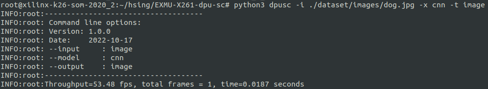
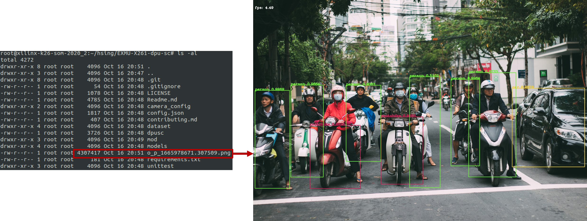

<!--
 Copyright (c) 2022 Innodisk Crop.
 
 This software is released under the MIT License.
 https://opensource.org/licenses/MIT
-->

# dpu-sc 

# Description
Dpu-sc is a sample code that uses DPU instead of GPU for AI inference. 

# Requirements
## Dependencies on platform
- Xilinx [KV260](https://www.xilinx.com/products/som/kria/kv260-vision-starter-kit.html)
  - Opencv
  - XIR
  - VART
  - Vitis-AI 1.4

## Python's requirements
```bash
sudo python3 -m pip install --upgrade pip
sudo python3 -m pip install scikit-build cmake opencv-python mock cython
sudo python3 -m pip install tensorflow==2.4.1 -f https://tf.kmtea.eu/whl/stable.html
```

# How to use dpusc
We provide two models for sample:
1. customcnn: Default CNN model. For inference cats and dogs. In dpu-sc, you can add argument `-x cnn` to use it.
2. yolov3-voc: Default YOLO model. For inference some common objects. In dpu-sc, you can add argument `-x yolo` to use it.

> Notice: Our models is built for DPU4096, if you want to use DPU3136 or others DPU config, please contact James(james_chen@innodisk.com).

and if you want to change model, you can modify model path in config.json.
```bash 
python3 dpusc -i <path-to-image>        -x <xmodel-type>  -t <output-type>
              -v <path-to-video>
              -c <webcam device nodes>
```
## Example - CNN
```bash 
# Inference with image, output image, using CNN
python3 dpusc -i dataset/images/dog.jpg -x cnn -t image
```
After execute above command(use CNN xmodel), you will get the result and the output image like below:



## Example - YOLO
```bash   
# Inference with image, output DP, using yolo
python3 dpusc -i dataset/images/moto.jpg -x yolo -t dp
```
After execute above command(use YOLO xmodel), you will get the result and the output image like below:



## Other Options
```bash 
# Inference with video, output image, using yolo
python3 dpusc -v dataset/videos/walking_humans.nv12.1920x1080.h264 -x yolo -t image

# Inference with video, output video, using yolo
python3 dpusc -v dataset/videos/walking_humans.nv12.1920x1080.h264 -x yolo -t video

# Inference with webcam, output DP, using yolo
python3 dpusc -c 0 -x yolo -t dp

# Inference with webcam, output image, using yolo
python3 dpusc -c 0 -x yolo -t image
```

# Dataset rules
### If run with CNN, you must follow the format of dataset naming rule which is label on the prefix of file name.  
e.g.   
  - at images_demo we detect cat or dog.  
  - at images_usb we detect perfect or defect.  
  
and so on.  

# Config.json
Xmodel and environment settings are in `config.json`.
- DISPLAY
    ```json
    "DISPLAY": {
        "WIDTH": "1920",
        "HEIGHT": "1080"
    }
    ```
    |Key Name|Description|
    |:-|:-|
    |`WIDTH`|The width of your display resolution.|
    |`HEIGHT`|The height of your display resolution.|

- MODLES-XMODELS_CLASS
    ```json
    "MODLES": {
        "XMODELS_CLASS": {
            "TYPE": "cnn",
            "MODEL": "models/cnn/customcnn.xmodel",
            "CLASS": ["dog", "cat"],
            "INPUT_SIZE": [250, 200]
        }
    }
    ```
    |Key Name|Description|
    |:-|:-|
    |`TYPE`|Xmodel's type.|
    |`MODEL`|Path to xmodel.|
    |`CLASS`|The classes that the xmodel provide.|
    |`INPUT_SIZE`|The image size that the xmodel can accept.|
  
- MODLES-XMODELS_OBJ
    ```json
    "MODLES": {
        "XMODELS_OBJ": {
            "TYPE": "yolo",
            "MODEL": "models/obj/yolov3-voc.xmodel",
            "CLASS": ["aeroplane", "bicycle", "bird", "boat", "bottle", "bus", "car", "cat", "chair", "cow",  "diningtable", "dog", "horse", "motobike", "person", "pottedplant", "sheep", "sofa", "train", "tv"],
            "ANCHORS": [ 10, 13, 16, 30, 33, 23, 30, 61, 62, 45, 59, 119, 116, 90, 156, 198, 373, 326],
            "INPUT_SIZE": [416, 416],
            "IOU": "0.213",
            "NMS": "0.45",
            "CONF": "0.2",
            "BOX_MAX_NUM": "30"
        }
    }
    ```
    |Key Name|Description|
    |:-|:-|
    |`TYPE`|Xmodel's type.|
    |`MODEL`|Path to xmodel.|
    |`CLASS`|The classes that the xmodel provide.|
    |`ANCHORS`|The anchors that the xmodel provide.|
    |`INPUT_SIZE`|The image size that the xmodel can accept.|
    |`IOU`|Xmodel's IoU(Intersection over Union).|
    |`NMS`|Xmodel's NMS(Non-Maximum Suppression).|
    |`CONF`|Xmodel's confidence.|
    |`BOX_MAX_NUM`|The maximum number of bounding box that can be displayed in an image.|
- OUTPUT
    ```json
    "OUTPUT": {
        "VIDEO_OUTPUT": "./output.mp4",
        "IMAGE_OUT_DIR": "./"
    }
    ```
    |Key Name|Description|
    |:-|:-|
    |`VIDEO_OUTPUT`|The path of the output video.|
    |`IMAGE_OUT_DIR`|The path of the output image directory.|

# Uint Test
provide unittest script in [/unittest](https://github.com/aiotads/DPU_SC/tree/main/unittest).

# FAQ
## If you can not download & install tensorflow-2.4.1
You can use our RPM package to install (please contact james_chen@innodisk.com).

## Contribution
[Contributing](contributing.md)

## License
[MIT](LICENSE)